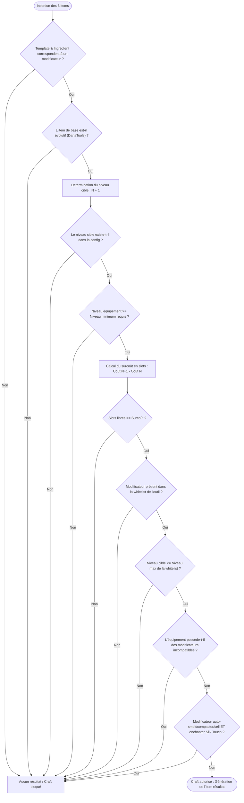

# 🔨 La Forge & la Table de Forgeron — DanaTools

Ce guide détaille l'utilisation de la Table de Forgeron (Smithing Table) pour l'application et l'amélioration de modificateurs sur les outils et armures évolutifs.

---

## 1. Interface de Forge

La forge repose entièrement sur l'interface native de la Table de Forgeron de Minecraft, organisée en trois slots d'entrée et un slot de résultat.

```
+-------------------+   +--------------------+   +---------------------+
|  Slot 1 : Plaque  | + |   Slot 2 : Base    | + | Slot 3 : Ingrédient | ===> [ Résultat ]
| (Template Smithing|   | (Outil ou Armure   |   | (Noyau élémentaire  |
|  de Modificateur) |   |    évolutive)      |   |  ou composant)      |
+-------------------+   +--------------------+   +---------------------+
```

* **Slot 1 (Template) :** Plaque de modificateur (ex: Template d'ornement ou autre item configuré). Le plugin valide le type de matériel, le `CustomModelData` et le nom d'affichage.
* **Slot 2 (Base) :** L'outil ou la pièce d'armure évolutive possédant le PersistentDataContainer (PDC) de DanaTools.
* **Slot 3 (Addition) :** L'ingrédient requis (ex: Noyau de Terre sous forme de tête Base64, lingots, sucre, etc.). Le plugin vérifie sa validité par type, nom, model-data ou texture de tête.

---

## 2. Diagramme d'Algorithme de Validation

Voici le workflow complet de validation lors de l'insertion des items dans la Table de Forgeron (`PrepareSmithingEvent`) :



---

## 3. Détails des Règles de Forge

### A. Calcul Dynamique du Coût en Slots
Les équipements possèdent un nombre maximal d'emplacements (slots) débloqués. L'application ou l'amélioration consomme ces slots.
Le plugin utilise un système de facturation **incrémentiel (surcoût)**. Lors d'un passage du niveau $N$ au niveau $N+1$, vous ne payez que la différence :

$$\text{Surcoût} = \text{Coût(Cible)} - \text{Coût(Actuel)}$$

*Exemple avec Excavation (trench) :*
- Niveau I : Coût = 1 slot. (Application initiale : consomme **1 slot**).
- Niveau II : Coût = 2 slots. (Upgrade depuis I : consomme **1 slot** supplémentaire, $2 - 1 = 1$).
- Niveau III : Coût = 4 slots. (Upgrade depuis II : consomme **2 slots** supplémentaires, $4 - 2 = 2$).

### B. Whitelists et Niveaux Maximum
Chaque fichier d'outil/armure (ex: `heavy_pickaxe.yml`) intègre une whitelist restrictive `allowed-modifiers` :
```yaml
allowed-modifiers:
  trench: 3       # Excavation autorisée jusqu'au niveau 3 maximum
  vein_miner: 2   # Minage en veine autorisé jusqu'au niveau 2 maximum
```
Si un joueur tente d'insérer une plaque d'Excavation III sur une pioche n'autorisant que le niveau II, la Table de Forgeron refusera le craft.

### C. Incompatibilités Mutuelles
Certains modificateurs sont incompatibles entre eux (ex: `trench` et `vein_miner`). Si l'un est présent sur l'item, la forge refusera d'appliquer le second (le résultat sera vide).

### D. Incompatibilité Spécifique : Silk Touch
Les modificateurs modifiant directement le butin cassé ou ramassé (`auto_smelt`, `compactor` et `auto_sell`) sont techniquement incompatibles avec l'enchantement vanilla **Toucher de Soie** (Silk Touch). Si l'outil possède Silk Touch, ces modificateurs ne pourront pas lui être appliqués à la forge.

---

## 4. Retrait de l'Italique et Lore des Modificateurs

Lors de la récupération de l'objet forgé (`SmithItemEvent`) :
* Le plugin génère un lore propre en recalculant l'affichage.
* Tous les modificateurs s'affichent sous forme de liste dans le lore de l'item.
* Le plugin applique explicitement la suppression de l'italique et applique les styles définis dans [lang/fr.yml](https://github.com/DanaKube-Mc/DanaTools/blob/main/src/main/resources/lang/fr.yml).
* Un son de forge d'enclume retentit (`BLOCK_ANVIL_USE`) et des particules de lave jaillissent de la Table de Forgeron.
