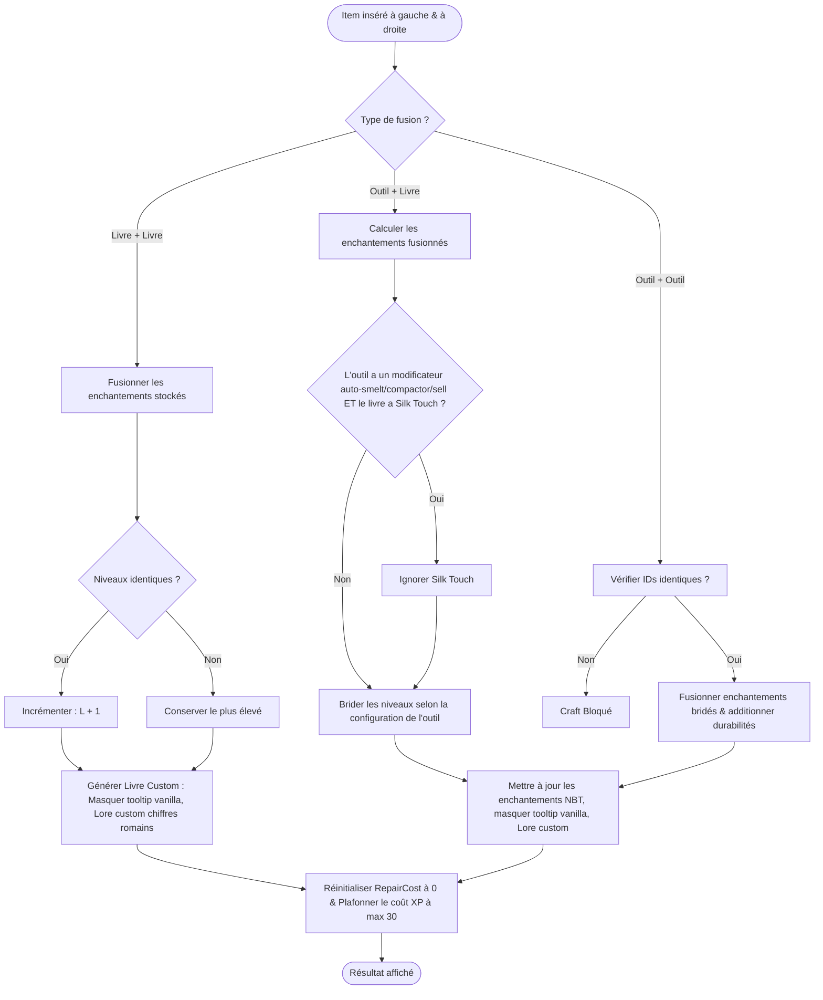

# ⚡ Gestion de l'Enclume & Enchantements Débridés — DanaTools

Ce guide décrit comment le plugin **DanaTools** prend le contrôle de l'enclume pour débrider les limites d'enchantement vanilla, fusionner des équipements/livres et réinitialiser les pénalités de coût cumulé.

---

## 1. Débridage des Limites d'Enchantement

Par défaut, Minecraft bride les enchantements à des valeurs prédéfinies (ex: *Efficacité V*, *Solidité III*).
**DanaTools** permet de définir des limites personnalisées pour chaque type d'outil dans son fichier de configuration sous la clé `enchantment-limits`.

*Exemple de configuration dans `heavy_pickaxe.yml` :*
```yaml
enchantment-limits:
  EFFICIENCY: 15     # Efficacité max : XV
  UNBREAKING: 10     # Solidité max : X
  FORTUNE: 5         # Fortune max : V
```

### Fusion & Application
Lors de la combinaison dans l'enclume :
* **Livre + Livre :** Permet de fusionner deux livres possédant le même niveau d'enchantement $L$ pour obtenir un livre de niveau $L+1$. **Il n'y a pas de limite maximale** pour les fusions de livres purs (ex: créer un livre *Efficacité XV*).
* **Outil + Livre :** Applique les enchantements du livre sur l'outil, mais en les **bridant à la limite maximum configurée pour cet outil précis**. Si le livre est *Efficacité XVII* et la pioche est limitée à *XV*, la pioche résultante sera de niveau *XV*.
* **Outil + Outil :** Fusionne deux outils identiques de DanaTools. Leurs enchantements se combinent (selon les limites de l'outil) et leurs durabilités s'additionnent avec un bonus de réparation.

---

## 2. Diagramme d'Algorithme de Fusion à l'Enclume

Voici comment l'enclume intercepte et traite les fusions (`PrepareAnvilEvent`) :



---

## 3. Bypass du « Trop Cher ! » (Too Expensive)

Dans Minecraft vanilla, chaque réparation ou fusion à l'enclume augmente de manière exponentielle le tag NBT `RepairCost`. Dès que ce coût dépasse 39 niveaux d'XP, l'enclume affiche le message « Trop Cher ! » et refuse tout travail.

**Mécanique de DanaTools :**
- À chaque fusion impliquant un livre custom de haut niveau ou un outil DanaTools, le tag `RepairCost` est **réinitialisé à 0**.
- Le coût d'expérience en jeu est recalculé dynamiquement et **plafonné à un maximum configurable de 30 niveaux d'XP**.
- Les joueurs peuvent ainsi réparer et améliorer leurs outils indéfiniment sans jamais être bloqués.

---

## 4. Affichage & Formatage du Lore Custom

Pour éviter les limitations visuelles du jeu (Minecraft vanilla ne sait pas formater les chiffres romains supérieurs à X) et éliminer les doublons de descriptions :

1. **Masquage Vanilla :** Le plugin ajoute des drapeaux d'affichage (`ItemFlag.HIDE_ENCHANTS`, `ItemFlag.HIDE_ADDITIONAL_TOOLTIP` et `ItemFlag.HIDE_STORED_ENCHANTS`) sur l'item résultat. Cela masque totalement la description vanilla des enchantements.
2. **Réécriture du Lore :** Le plugin insère manuellement les enchantements sous forme de lignes de texte au tout début du Lore.
3. **Formatage Chiffres Romains :** Le plugin convertit dynamiquement le niveau d'enchantement en chiffres romains grâce à un convertisseur intégré (ex: `15` $\to$ `XV`, `28` $\to$ `XXVIII`).
4. **Style :** Les enchantements réguliers s'affichent en gris et les malédictions en rouge, avec **retrait strict de l'italique** pour une apparence premium et propre.

---

## 5. Persistance du Renommage

Le renommage des outils évolutifs a été adapté pour fonctionner de manière transparente et persistante :

* **Renommage sans ingrédient :** Vous pouvez insérer votre outil DanaTools dans le slot gauche et modifier son nom dans la boîte de texte (même si le slot droit est vide).
* **Sauvegarde PDC :** Le nouveau nom saisi est sauvegardé directement dans le PersistentDataContainer de l'item sous la clé NBT `custom_name`. Cela garantit que le nom personnalisé n'est pas écrasé lors des futurs level-ups.
* **Suppression de nom :** Si vous videz totalement la boîte de texte de l'enclume, le tag NBT `custom_name` est effacé, et l'outil retrouve automatiquement son nom d'affichage configuré par défaut dans son fichier YAML.
* **Uniformisation :** Le traitement du nom est partagé et appliqué de manière identique que ce soit lors d'un renommage simple, d'une fusion Outil + Livre, ou d'une fusion Outil + Outil.
